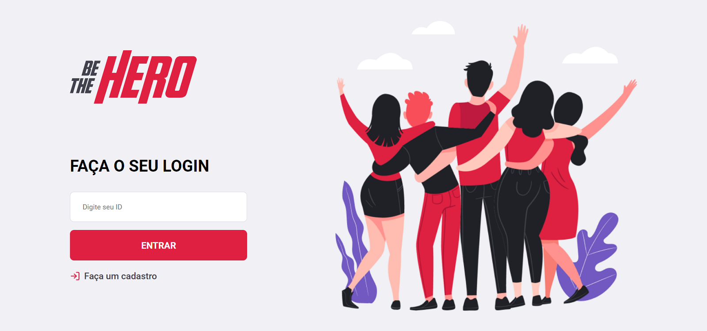
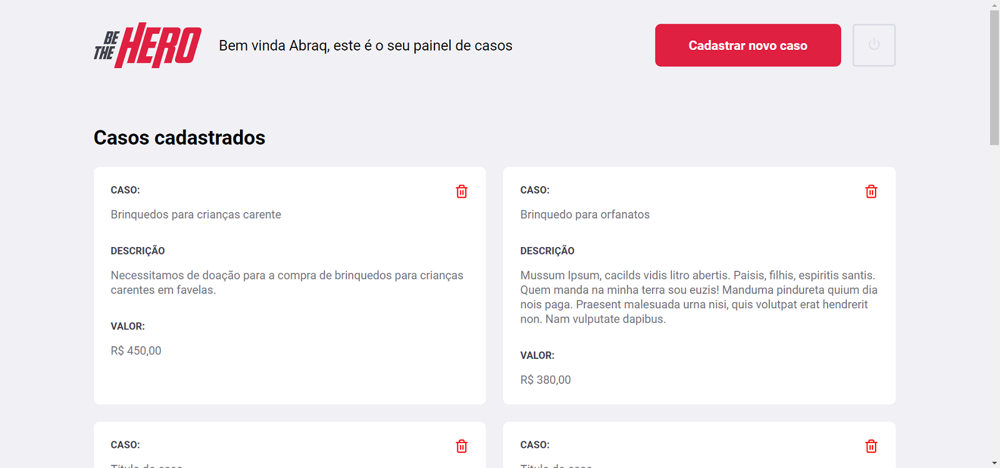
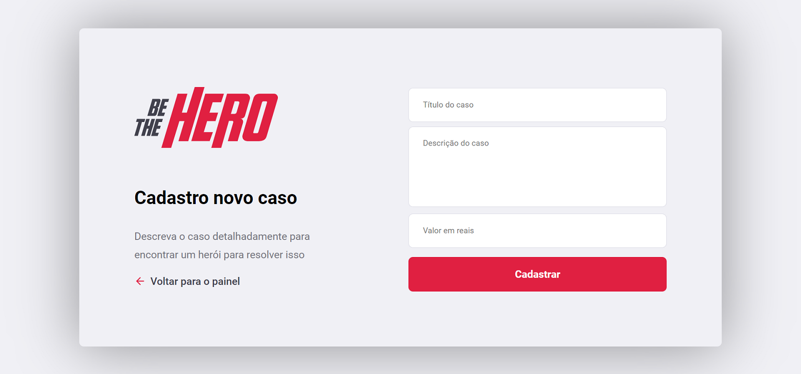
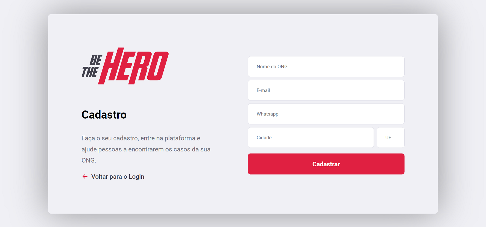
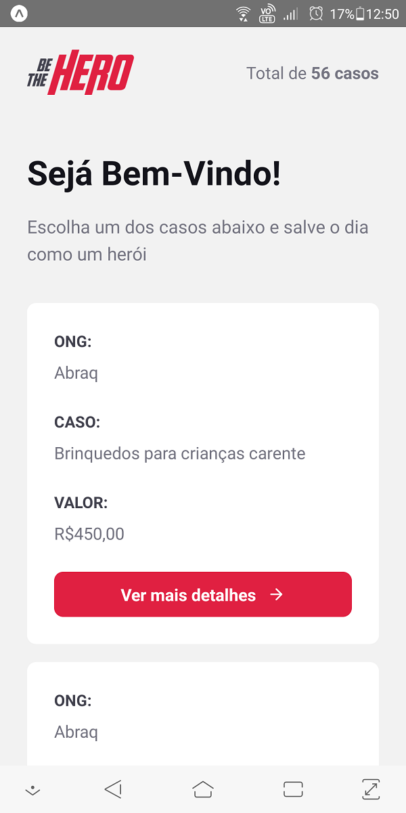
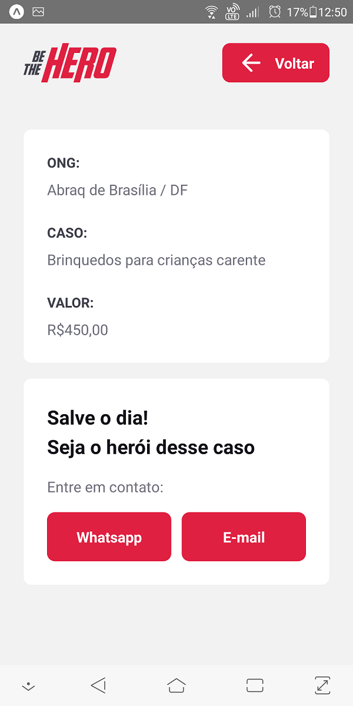

<h4 align="center">

 Projeto Be The Hero - Seja um heroi para alguém 🦸‍♂️
</h4>

    
    
    

## :bulb: Objetivo do projeto 

O projeto Be The Hero irá conectar ONG's que necessitam de ajuda com pessoas que queiram ajudar.
Nele, ONG's iram cadastrar projetos e as pessoas interessadas poderam doar um valor qualquer para a causa.

## :alien: Técnologias

- [Node.js](https://nodejs.org/en/)
- [React](https://pt-br.reactjs.org/)
- [React Native](https://reactnative.dev/)
- [Expo](https://expo.io/)

## :computer: Pagina Web

  
  
  
  

## :iphone: App Mobile

  
  

 ## :tv: Redes Sociais
 Abaixo algumas das minhas redes sociais:
 
    
  
   
  
   

  